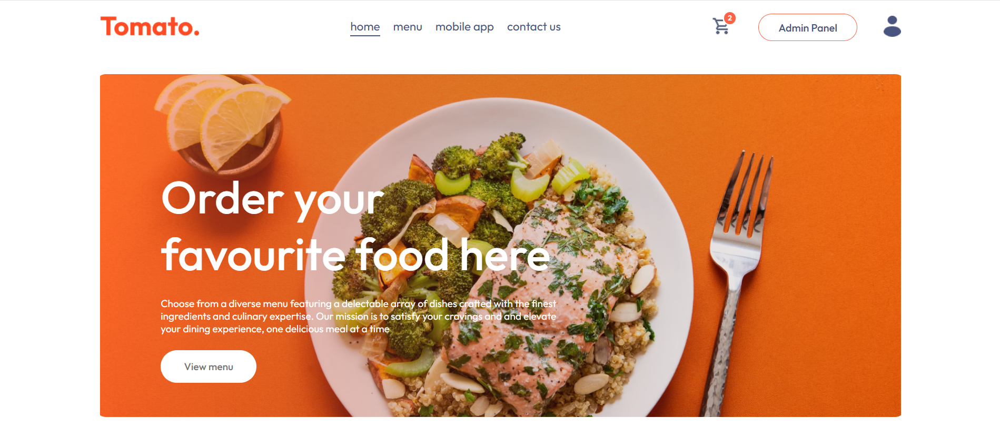
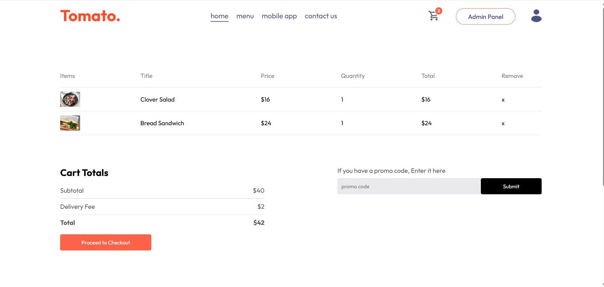
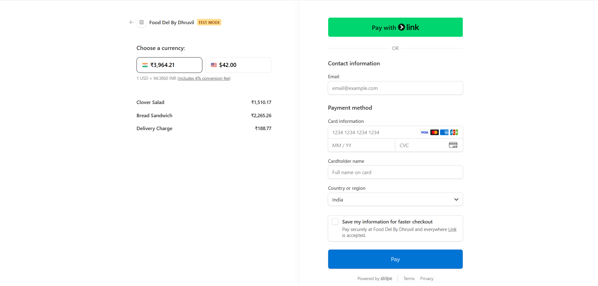

# 🍽️ Food Delivery App

Food Delivery is a full-stack web application built using the MERN stack. It allows users to browse food items, add them to cart, and place orders with secure online payments, while providing a dedicated admin panel to manage food items and orders efficiently.

---

## 🚀 Live Demo
🔗 https://food-del-frontend-ten.vercel.app/

---

## 🚀 Features

- **Browse Food & Categories**  
  Users can explore food items categorized for easy navigation.

- **Cart Functionality**  
  Add items to cart, update quantity, and proceed to checkout.

- **User Authentication**  
  Secure login & signup using JWT authentication.

- **Order Management**  
  Users can view their order history and track orders.

- **Stripe Payment Integration**  
  Secure online payments with Stripe and webhook verification.

- **Admin Panel**  
  Admin can add, delete, and manage food items, and update order status.

---

## 🛠️ Tech Stack

**Frontend (User + Admin):**
- React.js  
- Tailwind CSS  
- Axios  
- React Router  
- React Hot Toast  

**Backend:**
- Node.js  
- Express.js  
- MongoDB (Mongoose)  

**Authentication & Security:**
- JWT (JSON Web Tokens)  
- bcryptjs (Password Hashing)  
- validator  
- HTTP-only cookies  

**File Upload & Storage:**
- Multer (File Upload Handling)  
- Cloudinary (Cloud Image Storage)  

**Payment Integration:**
- Stripe (Payment Gateway + Webhook Verification)  

---

## 📸 Screenshots

### 🏠 Home Page


### 🍔 Food Listing


### 🛒 Cart Page


### 📦 Orders Page


### 💳 Stripe Payment


### 🔐 Admin Panel


---

## ⚙️ Installation

Follow the steps below to set up the project locally:

### 1. Clone the repository
```bash
git clone https://github.com/your-username/Food_delivery.git
cd Food_delivery
```

### 2. Install backend dependencies
```bash
cd backend
npm install
```

### 3. Install frontend dependencies
```bash
cd ../frontend
npm install
```

### 4. Install admin dependencies
```bash
cd ../admin
npm install
```

### 5. Create environment files

#### backend/.env
```bash
MONGODB_URI=your_mongodb_connection

JWT_SECRET=your_secret_key

# Cloudinary
CLOUDINARY_CLOUD_NAME=your_cloud_name
CLOUDINARY_API_KEY=your_api_key
CLOUDINARY_API_SECRET=your_api_secret

# Stripe
STRIPE_SECRET_KEY=your_stripe_secret
STRIPE_WEBHOOK_SECRET=your_webhook_secret
```
#### frontend/.env
```bash
VITE_BACKEND_URL = http://localhost:5000
VITE_ADMIN_URL = http://localhost:5174
```
### admin/.env
```bash
VITE_BACKEND_URL = "http://localhost:5000"
VITE_FROTEND_URL = "http://localhost:5173"
```
### 6.  Run the application
####  Start the frontend
```bash
cd frontend
npm run dev
```

####  Start the backend
```bash
cd backend
npm run server
```

####  Start Admin Panel
```bash
cd admin
npm run dev
```
---
## 👨‍💻 Author

**Dhruvil Parmar**

📧 dhruvilparmar1819@gmail.com
🔗 https://www.linkedin.com/in/your-linkedin-username/
